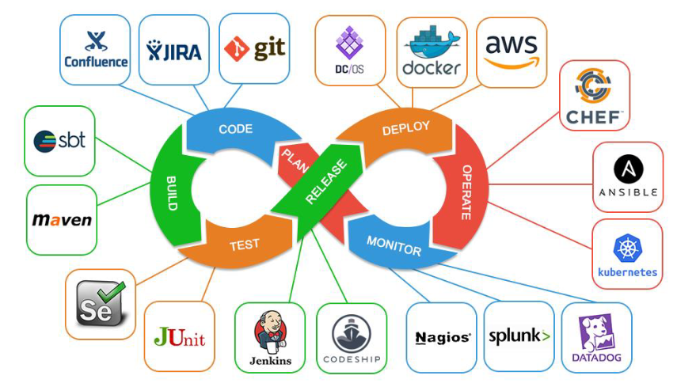
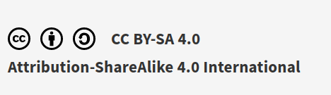

<!-- TITULO -->
# Devops

<!-- subtitulo -->

## Figura Devops en la Actualidad

## INDICE

1. **[Introducción](introduccion.md)**
2. **[¿Qué es un administrador de sistemas?](quees.md)**
3. **[¿Qué es un desarrollador?](devs.md)**
4. **[¿Qué es Devops?](devosi.md)**
5. **[Pérfil de Devops](profile.md)**

## Referencias
>https://educacionadistancia.juntadeandalucia.es/centros/sevilla/pluginfile.php/1047153/mod_label/intro/Introducci%C3%B3n%20a%20Devops.pdf

## Licencia

